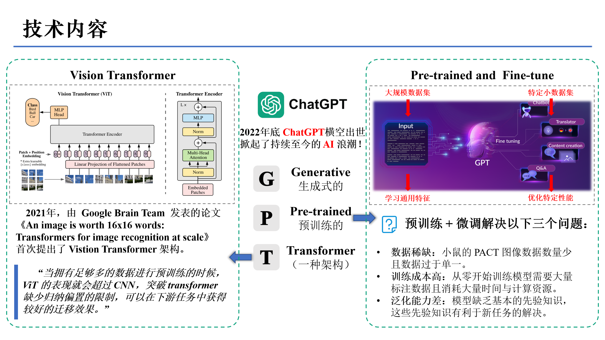
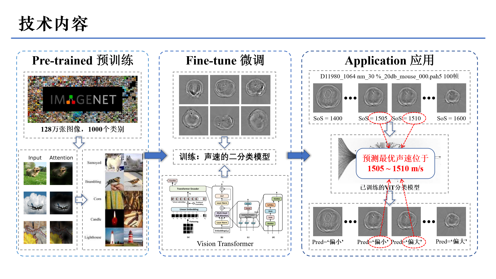

# PACT-SoS-Classification

## 前言

**光声计算机断层扫描 (PACT)** 作为一种新兴的生物医学成像方式，在处理光声信号原始数据重构生物组织断层图像的过程中，必须指定组织介质内的声速参数。

然而，通常情况下，这个声速值是**未知的**，需要有经验的工程师手动进行调节，这是一件机械枯燥且费时的事情。

因此，我训练了一个基于 **ViT(Vision Transformer)** 的二分类器，对重构图像的声速参数进行分类，最终得到一个较为合适的重构声速。

（注：由于完整代码涉及公司私有数据和代码，无法上传至开源平台，因此本程序暂无法正常运行。）

## 中间过程

**详见以下两篇 notion 笔记：**

[基于CNN的声速分类器](https://www.notion.so/CNN-2255fc5d0a698000996efb0380b9150a)

[基于ViT的声速分类器](https://www.notion.so/ViT-2375fc5d0a69804c9eddd4cf432285a4)

**简单来说：**

经测试，NiN 是几个 CNN 模型中分类效果最好的，训练时间短且能快速收敛，但对于质量较差的图像分类效果不佳；

从头开始训练的 ViT 模型泛化能力很差，基于 ImageNet-1k 预训练的 ViT_B_16 模型并在小鼠数据集上进行微调，分类效果最佳。

**以下是工作汇报PPT**

## 最终结果

基于 ImageNet-1k 预训练的 ViT_B_16 模型并在小鼠数据集上进行微调，训练得到的模型能够对全新的小鼠数据进行有效分类，
与真实最佳声速相比，最大误差小于 4 m/s，平均误差为 1~2 m/s。

（注：在软件实际使用场景中，声速相差 5 m/s 的图像肉眼几乎看不出差别，因此最佳声速的标注会受到我的主观和经验影响，本身就存在误差。）

在仅 12 只小鼠的数据作为训练集的情况下，ViT 模型平均误差在 3 m/s 以内，且针对一只全新小鼠数据预测的平均用时在 5 秒以内，因此程序是相对成功的。

