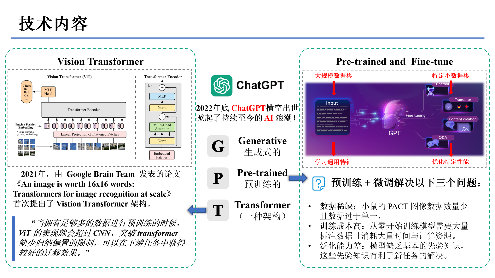
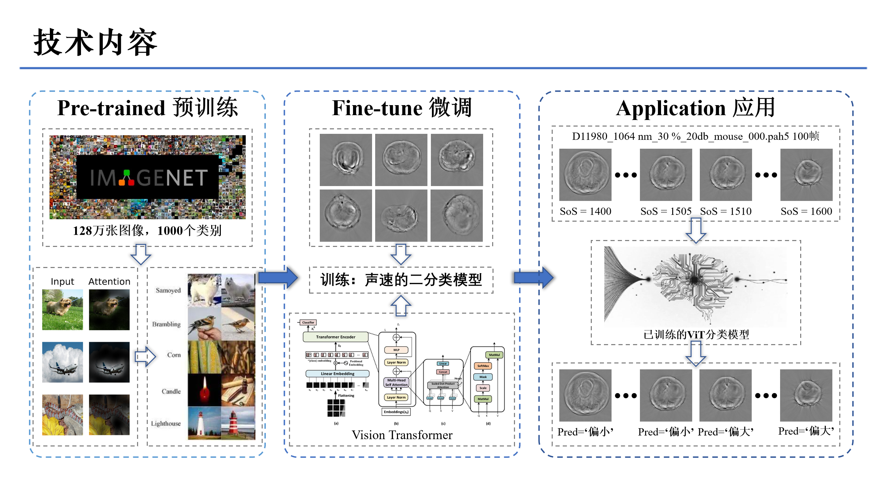
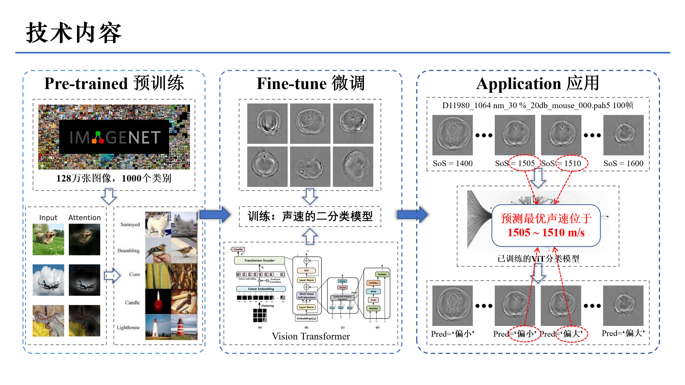

# PACT-SoS-Classification

## 前言

**光声计算机断层扫描 (PACT)** 作为一种新兴的生物医学成像方式，在处理光声信号原始数据重构生物组织断层图像的过程中，必须指定组织介质内的**声速参数**。

然而，通常情况下，这个声速值是**未知的**，需要有经验的工程师手动进行调节，这是一件**机械枯燥且费时**的事情。

因此，我训练了一个基于 **ViT(Vision Transformer)** 的二分类器，对重构图像的声速参数进行分类，最终得到一个较为合适的重构声速。

（注：根据与实习公司的《保密协议》，数据与代码均无法上传至开源平台，该文档仅作为我的实习工作记录）

## 思路与过程

整体过程可划分为 **强化学习阶段** 和 **分类器阶段**：

项目的最初目标是基于强化学习训练一个智能体，该智能体能自动的寻找一组小鼠数据对应的最优声速。出现了以下问题：

1. **过拟合（最重要的问题）：** 学会下一帧图像忘记上一帧，学会这一只小鼠忘记上一只，训练时间长，泛化能力差。
2. **状态太多：** 合理声速范围在 1400～1600 m/s ，根据精度要求不同，一帧小鼠的图像就会产生 40～200 个状态。
3. **奖励不好设置：** 最优声速往往在 1500 m/s 附近，智能体随机初始于两端，因奖励设置不合适智能体在边界打转。

因此，经过讨论，决定先训练一个**声速分类器**，将声速范围由 200 m/s,缩窄至 10～20 m/s，再使用强化学习训练智能体自动寻优。

**（没想到的是，声速分类器的结果已经能满足项目要求）**

**以下是工作汇报 PPT （仅分类器）：**

经测试，NiN 是几个 CNN 模型中分类效果最好的，训练时间短且能快速收敛，但对于质量较差的图像分类效果不佳；

从头开始训练的 ViT 模型泛化能力很差，基于 ImageNet-1k 预训练的 ViT_B_16 模型并在小鼠数据集上进行微调，分类效果最佳。

**以下两篇 notion 笔记，记录了分类器阶段的训练过程等详细信息：**

[基于CNN的声速分类器](https://www.notion.so/CNN-2255fc5d0a698000996efb0380b9150a)

[基于ViT的声速分类器](https://www.notion.so/ViT-2375fc5d0a69804c9eddd4cf432285a4)

## 最终结果

基于 ImageNet-1k 预训练的 ViT_B_16 模型并在小鼠数据集上进行微调，训练得到的模型能够对全新的小鼠数据进行有效分类，
与真实最佳声速相比，最大误差小于 4 m/s，平均误差为 1~2 m/s。

（注：在软件实际使用场景中，声速相差 5 m/s 的图像肉眼几乎看不出差别，因此最佳声速的标注会受到我的主观和经验影响，本身就存在误差。）

在仅 12 只小鼠的数据作为训练集的情况下，ViT 模型平均误差在 3 m/s 以内，且针对一只全新小鼠数据预测的平均用时在 5 秒以内，因此程序是相对成功的。

